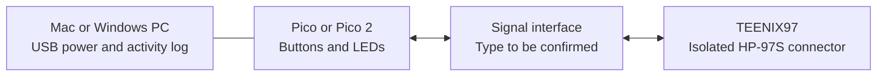

# Standalone HP-97S test device

Proposed first prototype, 23 September 2026. This is a design brief, not a verified
wiring diagram or finished firmware. Gordon has confirmed that a Raspberry Pi
Pico or Pico 2 is available; use that board rather than buying another controller.

## Purpose

Exercise the TEENIX97 board's isolated external-equipment connector directly:
send a known number into the calculator and display its Ready signal and four
flags. This provides an independent test of that interface without relying on
the Bluetooth PC-test routing currently under investigation.

## First prototype

A small controller on a breadboard, powered by USB, with:

| Control or indicator | Function |
| --- | --- |
| Read status button | Requests Ready and Flags 0–3 once. |
| Send test number button | Requests fresh status, then sends `34.27` if ready. No ENTER or Run A is appended. |
| Four LEDs | Display the most recently reported Flags 0–3. |
| Ready LED | Indicates Ready from the latest valid reply or flag notification. |
| USB activity log | Shows sent/received bytes, errors, and whether indicator data is current. |

Use the available Raspberry Pi Pico or Pico 2, with USB for power/logging and one
hardware UART for the calculator. Check which model it is before choosing its
firmware image. Fit headers if the existing board does not have them. An OLED
display and sensor are not needed for the first test.

The Pico's GPIO uses 3.3 V logic; its USB supply voltage is not its serial signal
voltage. The adapter between the controller and TEENIX97 must be selected after
the signal requirements below are confirmed.



## Electrical details to confirm with Tony

The board manual describes a four-wire interface: external 3.3–5 V supply,
transmit, receive and external ground. The signal names do not establish a
physical pin order. The manual also calls the connection RS-232, without enough
detail to establish conventional RS-232 voltage levels versus logic-level UART.

Before drawing the final wiring or specifying an adapter, establish:

1. The four physical pin positions and connector orientation for this board.
2. Transmit/receive direction as viewed from the external controller.
3. Input and output voltage levels, idle polarity, and any required pull-ups.
4. Whether powering the isolated interface at 3.3 V makes it directly compatible
   with 3.3 V UART signals, and how much supply current it requires.

The external supply powers the isolated interface, not the HP-97 itself.
Retain the board's isolation: use its documented external ground, rather than
adding an unverified connection to calculator battery ground. Do not treat a
generic USB-to-RS-232 adapter and a USB-to-TTL-UART adapter as interchangeable.

## Protocol and firmware behaviour

Use the external connector at **19200 baud, 8 data bits, no parity, one stop bit**,
with binary bytes and protocol acknowledgements. These settings are distinct
from Teenio's normal Bluetooth connection.

For this physical external device, connect the completed interface first, then
enable 97S **from the calculator menu** with the calculator in RUN. Disconnect
Teenio and CalCom during the initial bench test to avoid mixing access paths.
The external controller must not send PC-only mode commands `12` or `F5`.

The tester starts idle, without automatically sending a number. Read status uses
`F0` and decodes Ready (bit 4) and Flags 0–3. Idle flag-change notifications are
decoded separately from transfer acknowledgements. LED state must not be
presented as current after a timeout or invalid response.

The first Send operation follows this sequence, with each arrow representing a
request followed by its reply, not a single combined packet:

```text
F0 -> status with Ready set
F1 -> F1
03 -> F1
04 -> F1
0A -> F1
02 -> F1
07 -> F1
0F -> A0
```

Require the prompt before sending each key and stop after acceptance. On a
timeout, `A1`, `A2`, an unexpected response, or an unverified interleaved
notification, stop without retrying keys. Record exactly where the exchange
stopped. Recovery must be explicit because a partial entry may already have
reached the calculator. A new valid status is required before another transfer.

Later firmware can add reviewed arbitrary entries and a separate Run A action.
Use the conservative maximum of nine actionable symbols and handle Run A's
immediate `A0` completion, as described in the firmware follow-up notes. No
automatic program execution is needed for the first prototype.

## Bench acceptance checks

| Check | Evidence to collect |
| --- | --- |
| Status only | A valid response to `F0`; compare Ready with calculator state. |
| Flag outputs | Set/clear each flag on the calculator and check its corresponding LED and logged status. |
| Numerical input | Send `34.27` once; verify both final `A0` and `34.27` on the calculator display. |
| Not ready | Check that the tester refuses to send digits when Ready is clear. |
| Recovery logic | Test missing/unexpected replies with a software peer before connecting real hardware. |

Numeric entry can set Flag 3 and make the interface not ready for the next input.
Clear that flag at the calculator as appropriate, then request status again.
The protocol returns flags and readiness, not an arbitrary numerical X-register
result. A transfer acknowledgement therefore does not replace checking the
calculator display.

## Useful second stage

Add a potentiometer as a simulated measurement source. A button captures its
current value and sends a short numerical reading. A small HP-97 program can
process it and set flags to drive the tester's LEDs. A real sensor could later
replace the potentiometer.

The USB log could eventually be displayed inside Teenio Web. That would require
a separate USB-controller connection and appropriate UI; the current app's
Bluetooth chooser cannot connect to this tester. The controller should own the
calculator's per-byte handshakes so browser delays do not interrupt an entry.

## References

- [Supplied HP-97S protocol investigation](TEENIX97-HP97S-Protocol.md).
- [Firmware-21 routing and Run A follow-up](HP97S-firmware21-follow-up.md).
- [Raspberry Pi Pico series documentation](https://www.raspberrypi.com/documentation/microcontrollers/pico-series.html).
- [Raspberry Pi Pico datasheet: GPIO voltage and power](https://datasheets.raspberrypi.com/pico/pico-datasheet.pdf).
- [Official Pico UART example](https://github.com/raspberrypi/pico-examples/blob/master/uart/hello_uart/hello_uart.c).
